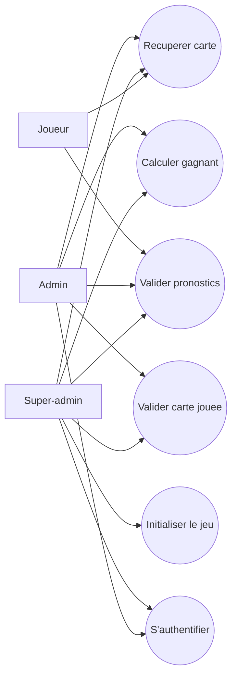
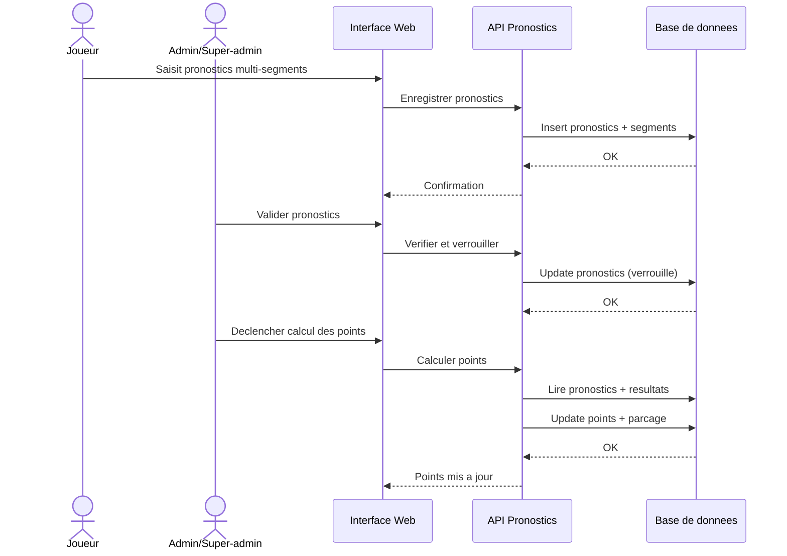
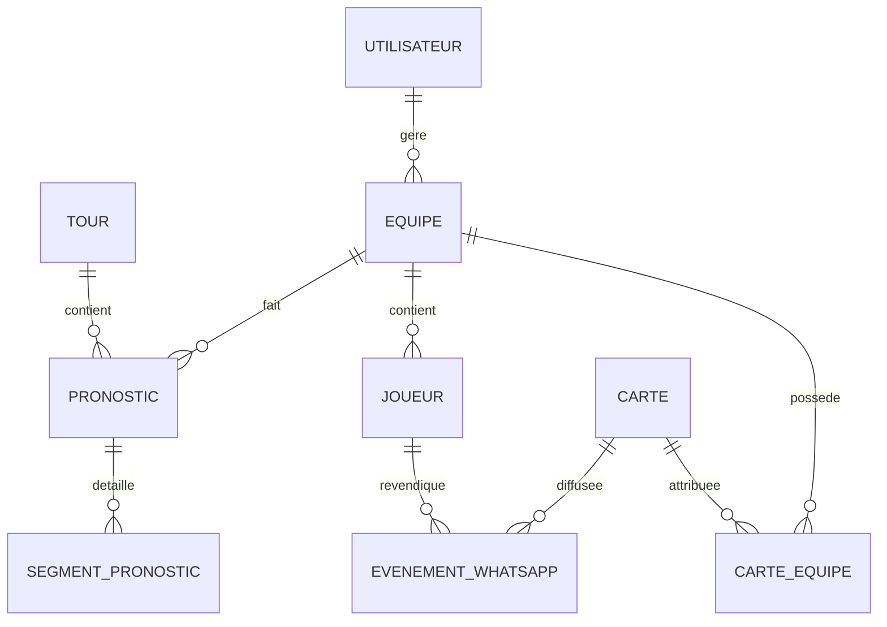

# TropUNO - Dossier de conception (CDA)

Ce document centralise la conception du projet TropUNO : expression des besoins,
cahier des charges, cas d'usage, scenarios, diagrammes, MCD/MLD et maquettes.

## 1) Expression des besoins

### Contexte
Le projet repond au besoin d'un groupe WhatsApp de supporters de l'OM : a chaque
competition, ils organisent un jeu base sur des pronostics de matchs (C1 ou
championnat). Jusqu'ici, tout etait fait manuellement (Excel + cartes envoyees
a la main). L'application vise a simplifier la gestion admin et ameliorer
l'experience joueurs.

### Objectif principal
Concevoir une application web qui automatise la gestion d'un jeu de pronostics
entre supporters, avec integration a l'API WhatsApp pour envoyer
automatiquement les cartes dans la conversation.

### Acteurs
- Super-admin : meme droits que l'admin + configure le jeu, gere les admins.
- Admin : pilote la session, envoie les cartes, valide les actions.
- Joueur : saisit ses pronostics, utilise ses cartes, suit son statut.

### Perimetre fonctionnel (MVP)
1. Authentification admin / super-admin (login + mot de passe)
2. Gestion equipes & joueurs + repartition aleatoire
3. Cartes bonus/malus (2 par equipe, 1 par tour max)
4. Pronostics multi-segments (score, buteurs, etc.)
5. Systeme de points & progression (20 pts pour acces complet, 60 pts pour
   sortir un joueur)
6. Cartes via WhatsApp + premier a taguer @admin gagne
7. Regles de victoire claires

### Regles de victoire
- Critere 1 : plus de joueurs hors parcage
- Departage 1 : plus de pronostics justes
- Departage 2 : total de points cumules le plus eleve

### Contraintes techniques
- Next.js + TypeScript
- Prisma + SQLite
- Integration API WhatsApp
- Temps reel (Socket.io)

### Hors perimetre (V1)
- Paiement
- Application mobile native
- Messagerie interne (WhatsApp utilise)

## 2) Cahier des charges (fonctionnel et technique)

### Besoins fonctionnels
- Authentifier les admins et le super-admin.
- Creer des equipes et des joueurs, puis repartir aleatoirement les joueurs.
- Gerer les cartes bonus/malus et leur utilisation avant chaque tour.
- Saisir des pronostics multi-segments par equipe.
- Calculer les points et appliquer les seuils (20 pts / 60 pts).
- Envoyer des cartes via WhatsApp et attribuer la carte au premier joueur qui
  tague @admin.
- Declarer l'equipe gagnante selon les regles de victoire.

### Besoins non fonctionnels
- Simplicite d'usage (admin et joueurs).
- Tracabilite des actions (historique de tours, cartes, points).
- Securite basique (auth admin, validation des entrees).
- Evolutivite (possibilite d'ajouter des segments de prono).

### Contraintes
- Budget et temps limites (projet CDA).
- Utilisation d'une API externe (WhatsApp Cloud API).

## 3) Cas d'usage (use cases)

### UC1 - Authentifier un admin
Acteurs : Admin / Super-admin  
But : Acceder a l'interface d'administration securisee.  
Pre-conditions : compte admin cree.  
Declencheur : l'admin ouvre /admin.  
Flux nominal :
1. L'admin saisit login + mot de passe.
2. Le systeme verifie les identifiants.
3. L'admin accede au tableau de bord.
Post-conditions : session admin active.

### UC2 - Initialiser le jeu
Acteur : Super-admin  
But : Creer les equipes, enregistrer les joueurs, lancer la repartition.  
Pre-conditions : super-admin authentifie.  
Declencheur : debut de competition.  
Flux nominal :
1. Le super-admin s'authentifie.
2. Il cree 4 equipes.
3. Il saisit la liste des joueurs.
4. Le systeme repartit aleatoirement les joueurs.
5. Le super-admin valide la liste finale.
Post-conditions : equipes et joueurs actifs pour la competition.

### UC3 - Gerer les pronostics
Acteurs : Joueur / Admin / Super-admin  
But : Saisir des pronostics et appliquer les regles de points.  
Pre-conditions : tour ouvert.  
Declencheur : ouverture d'un match a pronostiquer.  
Flux nominal :
1. Les joueurs saisissent leurs pronostics multi-segments.
2. Le systeme enregistre les pronostics.
3. Apres le match, l'admin valide les pronostics.
4. Une fois valides, les pronostics ne peuvent plus etre modifies.
5. Le systeme calcule les points.
6. Si 20 pts, l'equipe debloque tous les segments au tour suivant.
7. Si 60 pts, un joueur sort du parcage.
Post-conditions : points et etat de parcage mis a jour.

### UC4 - Envoyer une carte via WhatsApp
Acteur : Admin / Super-admin  
But : Envoyer une carte dans le groupe WhatsApp et l'attribuer.  
Pre-conditions : admin connecte, carte disponible.  
Declencheur : besoin d'animation / bonus malus.  
Flux nominal :
1. L'admin selectionne une carte a envoyer.
2. Le systeme envoie le message via l'API WhatsApp.
3. Un joueur recupere la carte en taguant @admin dans le groupe.
4. Le systeme attribue la carte a l'equipe du joueur.
Post-conditions : carte ajoutee a l'equipe.

### UC5 - Appliquer les cartes avant un tour
Acteurs : Equipe / Admin / Super-admin  
But : Jouer une carte (bonus/malus) avant le match.  
Pre-conditions : equipe possede une carte jouable.  
Declencheur : phase pre-match.  
Flux nominal :
1. L'equipe choisit une carte (1 max par tour).
2. L'admin valide l'utilisation.
3. Le systeme applique l'effet.
Post-conditions : carte consommee, effet applique.

### UC6 - Determiner le gagnant
Acteur : Admin / Super-admin  
But : Calculer le vainqueur selon les regles de victoire.  
Pre-conditions : competition terminee.  
Declencheur : fin des matchs.  
Flux nominal :
1. Le systeme compte les joueurs hors parcage.
2. En cas d'egalite, il compare les pronostics justes.
3. En cas de nouvelle egalite, il compare les points cumules.
Post-conditions : equipe gagnante declaree.

## 4) Scenarios (exemples)

### Scenario 1 - Lancement d'une competition
1. Le super-admin s'authentifie.
2. Il cree les 4 equipes.
3. Il enregistre les joueurs.
4. Il lance la repartition aleatoire des joueurs par equipe.
5. Il valide la liste finale.
6. Il demarre le premier tour.

### Scenario 2 - Pronostics et points
1. Les joueurs saisissent leurs pronostics.
2. L'admin valide les pronostics (ils deviennent non modifiables).
3. Le systeme calcule les points.
4. Si une equipe atteint 20 pts, elle debloque tous les segments pour le
   prochain match.
5. Si une equipe atteint 60 pts, un joueur sort du parcage.

### Scenario 3 - Carte WhatsApp
1. L'admin envoie une carte via l'interface.
2. La carte apparait dans le groupe WhatsApp.
3. Le premier joueur qui tague @admin recupere la carte pour son equipe.

## 5) Diagramme de fonctionnement

### Vue globale (texte)
1. Auth admin -> Acces admin
2. Setup equipes/joueurs -> Repartition aleatoire
3. Tour de prono -> Calcul points -> Mise a jour parcage
4. Envoi carte WhatsApp -> Attribution carte
5. Fin competition -> Calcul vainqueur

### Diagramme (mermaid - use case)

### Diagramme de sequence (mermaid - pronostics et points)

Explication : le joueur saisit ses pronostics via l'interface. L'API les
enregistre et confirme la prise en compte. Une fois les matchs termines, l'admin
valide les pronostics : ils sont alors verrouilles pour garantir l'integrite.
L'admin declenche ensuite le calcul des points, et le systeme met a jour les
points et l'etat de parcage. Cette sequence se repete a chaque tour.

## 6) MCD (modele conceptuel - version finale)

### Entites
- Utilisateur (roles : super-admin, admin)
- Equipe
- Joueur
- Tour
- Pronostic
- SegmentPronostic
- Carte
- CarteEquipe (possession d'une carte par une equipe)
- EvenementWhatsApp

### Relations (resume)
- Une Equipe possede plusieurs Joueurs (1,N).
- Un Joueur appartient a une seule Equipe (N,1).
- Un Tour comporte plusieurs Pronostics (1,N).
- Un Pronostic appartient a une Equipe et un Tour (N,1 + N,1).
- Un Pronostic contient plusieurs Segments (1,N).
- Une Equipe possede plusieurs Cartes via CarteEquipe (1,N).
- Un EvenementWhatsApp est lie a une Carte et peut etre revendique par un Joueur.

### Diagramme MCD (mermaid)

## 7) MLD (modele logique - version finale)

### Tables et principaux champs
- users(id, role, username, password_hash, created_at)
- teams(id, name, created_at)
- players(id, team_id, name, status, created_at)
- rounds(id, match_label, starts_at, ends_at, status)
- predictions(id, team_id, round_id, locked_at, total_points)
- prediction_segments(id, prediction_id, type, value, points)
- cards(id, type, effect, created_at)
- team_cards(id, team_id, card_id, status, acquired_at, used_at)
- whatsapp_events(id, card_id, message_id, claimed_by_player_id, claimed_at)

### Contraintes principales
- Un joueur appartient a une seule equipe.
- Un pronostic est unique par equipe et par tour.
- Un pronostic est modifiable tant qu'il n'est pas verrouille (locked_at).
- Une carte peut etre utilisee au plus une fois (team_cards.used_at).

## 8) Maquettes (a faire)

### Charte couleur (mobile-first)
- Primaire : Bleu nuit `#0F172A`
- Secondaire : Bleu OM `#005DAA`
- Accent : Orange `#F97316`
- Succes : Vert `#16A34A`
- Danger : Rouge `#DC2626`
- Fond : Gris clair `#F8FAFC`
- Texte : Gris fonce `#111827`

### Wireframes (mobile-first)

#### 1) Login admin
- Logo + titre
- Champ login
- Champ mot de passe
- Bouton "Se connecter" (accent)
- Message d'erreur

#### 2) Dashboard admin (mobile)
- Header : "Admin TropUNO"
- Cartes stats :
  - Equipes (nb)
  - Joueurs hors parcage (nb)
  - Tours joues (nb)
- Liste equipes (accordeon) :
  - Nom equipe + score total
  - Joueurs + statut (parcage / hors)
- Actions :
  - Bouton "Envoyer carte WhatsApp"
  - Bouton "Valider pronostics"

#### 3) Page pronostics equipe
- Header : Equipe + tour en cours
- Segments de pronostic (cartes empilables) :
  - Score
  - Nombre de buts
  - Buteurs
  - Ecart de score
- Bouton "Enregistrer"
- Etat : "Verrouille" si valide

#### 4) Historique tours / resultats
- Liste des tours (cartes) :
  - Match
  - Points par equipe
  - Equipe gagnante du tour
- Filtre par tour
- Details d'un tour (pronostics + points)

Note : a realiser sous Figma ou equivalent, puis joindre captures ici.

### Plan d'ecrans (detaille)

#### E1 - Login admin
- En-tete : logo + "TropUNO"
- Formulaire : login, mot de passe
- Bouton primaire : "Se connecter"
- Lien secondaire : "Mot de passe oublie" (optionnel)
- Feedback : message d'erreur, etat loading

#### E2 - Dashboard admin
- Header : titre + bouton de deconnexion
- KPIs : equipes, joueurs hors parcage, tours joues
- Section Equipes :
  - Carte equipe (nom, points, joueurs hors/parcage)
  - Badges etat (parcage / hors)
- Actions rapides :
  - Envoyer carte WhatsApp
  - Valider pronostics
  - Ouvrir nouveau tour

#### E3 - Gestion equipes/joueurs
- Liste equipes (edit/suppr)
- Ajout equipe
- Ajout joueurs (multi-champs)
- Bouton : "Repartir aleatoirement"

#### E4 - Pronostics equipe
- Header : equipe + tour
- Segments (accordeon) :
  - Score exact
  - Nombre de buts
  - Buteurs
  - Ecart de score
- Bouton : "Enregistrer"
- Etat : verrouille / editable

#### E5 - Historique tours
- Liste des tours (cartes)
- Detail tour : pronostics par equipe, points, gagnant
- Filtre par tour

#### E6 - Cartes WhatsApp
- Catalogue de cartes disponibles
- Bouton "Envoyer"
- Historique d'envoi (message, equipe gagnante)

### Parcours utilisateur (workflow mobile)

#### Parcours A - Super-admin (initialisation)
1. Se connecter.
2. Creer les equipes.
3. Ajouter les joueurs.
4. Lancer la repartition aleatoire.
5. Ouvrir le premier tour.

#### Parcours B - Joueur (pronostic)
1. Ouvrir l'ecran pronostics.
2. Renseigner les segments autorises.
3. Enregistrer.
4. Attendre la validation admin.

#### Parcours C - Admin (validation et points)
1. Ouvrir la liste des pronostics du tour.
2. Valider (verrouille).
3. Declencher le calcul des points.
4. Mettre a jour parcage / debloquer segments.

#### Parcours D - Carte WhatsApp
1. Admin envoie une carte via l'app.
2. Message recu sur WhatsApp.
3. Premier joueur a taguer @admin recupere la carte.
4. Carte affectee a l'equipe.
# TropUNO - Dossier de conception (CDA)

Ce document centralise la conception du projet TropUNO : expression des besoins,
cahier des charges, cas d'usage, scenarios, diagrammes, MCD/MLD et maquettes.

## 1) Expression des besoins

### Contexte
Le projet repond au besoin d'un groupe WhatsApp de supporters de l'OM : a chaque
competition, ils organisent un jeu base sur des pronostics de matchs (C1 ou
championnat). Jusqu'ici, tout etait fait manuellement (Excel + cartes envoyees
a la main). L'application vise a simplifier la gestion admin et ameliorer
l'experience joueurs.

### Objectif principal
Concevoir une application web qui automatise la gestion d'un jeu de pronostics
entre supporters, avec integration a l'API WhatsApp pour envoyer
automatiquement les cartes dans la conversation.

### Acteurs
- Super-admin : meme droits que l'admin + configure le jeu, gere les admins.
- Admin : pilote la session, envoie les cartes, valide les actions.
- Joueur : saisit ses pronostics, utilise ses cartes, suit son statut.

### Perimetre fonctionnel (MVP)
1. Authentification admin / super-admin (login + mot de passe)
2. Gestion equipes & joueurs + repartition aleatoire
3. Cartes bonus/malus (2 par equipe, 1 par tour max)
4. Pronostics multi-segments (score, buteurs, etc.)
5. Systeme de points & progression (20 pts pour acces complet, 60 pts pour
   sortir un joueur)
6. Cartes via WhatsApp + premier a taguer @admin gagne
7. Regles de victoire claires

### Regles de victoire
- Critere 1 : plus de joueurs hors parcage
- Departage 1 : plus de pronostics justes
- Departage 2 : total de points cumules le plus eleve

### Contraintes techniques
- Next.js + TypeScript
- Prisma + SQLite
- Integration API WhatsApp
- Temps reel (Socket.io)

### Hors perimetre (V1)
- Paiement
- Application mobile native
- Messagerie interne (WhatsApp utilise)

## 2) Cahier des charges (fonctionnel et technique)

### Besoins fonctionnels
- Authentifier les admins et le super-admin.
- Creer des equipes et des joueurs, puis repartir aleatoirement les joueurs.
- Gerer les cartes bonus/malus et leur utilisation avant chaque tour.
- Saisir des pronostics multi-segments par equipe.
- Calculer les points et appliquer les seuils (20 pts / 60 pts).
- Envoyer des cartes via WhatsApp et attribuer la carte au premier joueur qui
  tague @admin.
- Declarer l'equipe gagnante selon les regles de victoire.

### Besoins non fonctionnels
- Simplicite d'usage (admin et joueurs).
- Traçabilite des actions (historique de tours, cartes, points).
- Securite basique (auth admin, validation des entrees).
- Evolutivite (possibilite d'ajouter des segments de prono).

### Contraintes
- Budget et temps limites (projet CDA).
- Utilisation d'une API externe (WhatsApp Cloud API).

## 3) Cas d'usage (use cases)

### UC1 - Authentifier un admin
Acteurs : Admin / Super-admin  
But : Acceder a l'interface d'administration securisee.  
Pre-conditions : compte admin cree.  
Declencheur : l'admin ouvre /admin.  
Flux nominal :
1. L'admin saisit login + mot de passe.
2. Le systeme verifie les identifiants.
3. L'admin accede au tableau de bord.
Post-conditions : session admin active.

### UC2 - Initialiser le jeu
Acteur : Super-admin  
But : Creer les equipes, enregistrer les joueurs, lancer la repartition.  
Pre-conditions : super-admin authentifie.  
Declencheur : debut de competition.  
Flux nominal :
1. Le super-admin s'authentifie.
2. Il cree 4 equipes.
3. Il saisit la liste des joueurs.
4. Le systeme repartit aleatoirement les joueurs.
5. Le super-admin valide la liste finale.
Post-conditions : equipes et joueurs actifs pour la competition.

### UC3 - Gerer les pronostics
Acteurs : Joueur / Admin / Super-admin  
But : Saisir des pronostics et appliquer les regles de points.  
Pre-conditions : tour ouvert.  
Declencheur : ouverture d'un match a pronostiquer.  
Flux nominal :
1. Les joueurs saisissent leurs pronostics multi-segments.
2. Le systeme enregistre les pronostics.
3. Apres le match, l'admin valide les pronostics.
4. Une fois valides, les pronostics ne peuvent plus etre modifies.
5. Le systeme calcule les points.
6. Si 20 pts, l'equipe debloque tous les segments au tour suivant.
7. Si 60 pts, un joueur sort du parcage.
Post-conditions : points et etat de parcage mis a jour.

### UC4 - Envoyer une carte via WhatsApp
Acteur : Admin / Super-admin  
But : Envoyer une carte dans le groupe WhatsApp et l'attribuer.  
Pre-conditions : admin connecte, carte disponible.  
Declencheur : besoin d'animation / bonus malus.  
Flux nominal :
1. L'admin selectionne une carte a envoyer.
2. Le systeme envoie le message via l'API WhatsApp.
3. Un joueur recupere la carte en taguant @admin dans le groupe.
4. Le systeme attribue la carte a l'equipe du joueur.
Post-conditions : carte ajoutee a l'equipe.

### UC5 - Appliquer les cartes avant un tour
Acteurs : Equipe / Admin / Super-admin  
But : Jouer une carte (bonus/malus) avant le match.  
Pre-conditions : equipe possede une carte jouable.  
Declencheur : phase pre-match.  
Flux nominal :
1. L'equipe choisit une carte (1 max par tour).
2. L'admin valide l'utilisation.
3. Le systeme applique l'effet.
Post-conditions : carte consommee, effet applique.

### UC6 - Determiner le gagnant
Acteur : Admin / Super-admin  
But : Calculer le vainqueur selon les regles de victoire.  
Pre-conditions : competition terminee.  
Declencheur : fin des matchs.  
Flux nominal :
1. Le systeme compte les joueurs hors parcage.
2. En cas d'egalite, il compare les pronostics justes.
3. En cas de nouvelle egalite, il compare les points cumules.
Post-conditions : equipe gagnante declaree.

## 4) Scenarios (exemples)

### Scenario 1 - Lancement d'une competition
1. Le super-admin s'authentifie.
2. Il cree les 4 equipes.
3. Il enregistre les joueurs.
4. Il lance la repartition aleatoire des joueurs par equipe.
5. Il valide la liste finale.
6. Il demarre le premier tour.

### Scenario 2 - Pronostics et points
1. Les joueurs saisissent leurs pronostics.
2. L'admin valide les pronostics (ils deviennent non modifiables).
3. Le systeme calcule les points.
4. Si une equipe atteint 20 pts, elle debloque tous les segments pour le
   prochain match.
5. Si une equipe atteint 60 pts, un joueur sort du parcage.

### Scenario 3 - Carte WhatsApp
1. L'admin envoie une carte via l'interface.
2. La carte apparait dans le groupe WhatsApp.
3. Le premier joueur qui tague @admin recupere la carte pour son equipe.

## 5) Diagramme de fonctionnement

### Vue globale (texte)
1. Auth admin -> Acces admin
2. Setup equipes/joueurs -> Repartition aleatoire
3. Tour de prono -> Calcul points -> Mise a jour parcage
4. Envoi carte WhatsApp -> Attribution carte
5. Fin competition -> Calcul vainqueur

### Diagramme (mermaid - use case)

### Diagramme de sequence (mermaid - pronostics et points)

**Explication :** le joueur saisit ses pronostics via l'interface. L'API les
enregistre et confirme la prise en compte. Une fois les matchs termines, l'admin
valide les pronostics : ils sont alors verrouilles pour garantir l'integrite.
L'admin declenche ensuite le calcul des points, et le systeme met a jour les
points et l'etat de parcage. Cette sequence se repete a chaque tour.

## 6) MCD (modele conceptuel - version finale)

### Entites
- Utilisateur (roles : super-admin, admin)
- Equipe
- Joueur
- Tour
- Pronostic
- SegmentPronostic
- Carte
- CarteEquipe (possession d'une carte par une equipe)
- EvenementWhatsApp

### Relations (resume)
- Une Equipe possede plusieurs Joueurs (1,N).
- Un Joueur appartient a une seule Equipe (N,1).
- Un Tour comporte plusieurs Pronostics (1,N).
- Un Pronostic appartient a une Equipe et un Tour (N,1 + N,1).
- Un Pronostic contient plusieurs Segments (1,N).
- Une Equipe possede plusieurs Cartes via CarteEquipe (1,N).
- Un EvenementWhatsApp est lie a une Carte et peut etre revendique par un Joueur.

### Diagramme MCD (mermaid)

## 7) MLD (modele logique - version finale)

### Tables et principaux champs
- users(id, role, username, password_hash, created_at)
- teams(id, name, created_at)
- players(id, team_id, name, status, created_at)
- rounds(id, match_label, starts_at, ends_at, status)
- predictions(id, team_id, round_id, locked_at, total_points)
- prediction_segments(id, prediction_id, type, value, points)
- cards(id, type, effect, created_at)
- team_cards(id, team_id, card_id, status, acquired_at, used_at)
- whatsapp_events(id, card_id, message_id, claimed_by_player_id, claimed_at)

### Contraintes principales
- Un joueur appartient a une seule equipe.
- Un pronostic est unique par equipe et par tour.
- Un pronostic est modifiable tant qu'il n'est pas verrouille (locked_at).
- Une carte peut etre utilisee au plus une fois (team_cards.used_at).

## 8) Maquettes (a faire)

### Charte couleur (mobile-first)
- Primaire : Bleu nuit `#0F172A`
- Secondaire : Bleu OM `#005DAA`
- Accent : Orange `#F97316`
- Succes : Vert `#16A34A`
- Danger : Rouge `#DC2626`
- Fond : Gris clair `#F8FAFC`
- Texte : Gris fonce `#111827`

### Wireframes (mobile-first)

#### 1) Login admin
- Logo + titre
- Champ login
- Champ mot de passe
- Bouton "Se connecter" (accent)
- Message d'erreur

#### 2) Dashboard admin (mobile)
- Header : "Admin TropUNO"
- Cartes stats :
  - Equipes (nb)
  - Joueurs hors parcage (nb)
  - Tours joues (nb)
- Liste equipes (accordeon) :
  - Nom equipe + score total
  - Joueurs + statut (parcage / hors)
- Actions :
  - Bouton "Envoyer carte WhatsApp"
  - Bouton "Valider pronostics"

#### 3) Page pronostics equipe
- Header : Equipe + tour en cours
- Segments de pronostic (cartes empilables) :
  - Score
  - Nombre de buts
  - Buteurs
  - Ecart de score
- Bouton "Enregistrer"
- Etat : "Verrouille" si valide

#### 4) Historique tours / resultats
- Liste des tours (cartes) :
  - Match
  - Points par equipe
  - Equipe gagnante du tour
- Filtre par tour
- Details d'un tour (pronostics + points)

Note : a realiser sous Figma ou equivalent, puis joindre captures ici.

### Plan d'ecrans (detaille)

#### E1 - Login admin
- En-tete : logo + "TropUNO"
- Formulaire : login, mot de passe
- Bouton primaire : "Se connecter"
- Lien secondaire : "Mot de passe oublie" (optionnel)
- Feedback : message d'erreur, etat loading

#### E2 - Dashboard admin
- Header : titre + bouton de deconnexion
- KPIs : equipes, joueurs hors parcage, tours joues
- Section Equipes :
  - Carte equipe (nom, points, joueurs hors/parcage)
  - Badges etat (parcage / hors)
- Actions rapides :
  - Envoyer carte WhatsApp
  - Valider pronostics
  - Ouvrir nouveau tour

#### E3 - Gestion equipes/joueurs
- Liste equipes (edit/suppr)
- Ajout equipe
- Ajout joueurs (multi-champs)
- Bouton : "Repartir aleatoirement"

#### E4 - Pronostics equipe
- Header : equipe + tour
- Segments (accordeon) :
  - Score exact
  - Nombre de buts
  - Buteurs
  - Ecart de score
- Bouton : "Enregistrer"
- Etat : verrouille / editable

#### E5 - Historique tours
- Liste des tours (cartes)
- Detail tour : pronostics par equipe, points, gagnant
- Filtre par tour

#### E6 - Cartes WhatsApp
- Catalogue de cartes disponibles
- Bouton "Envoyer"
- Historique d'envoi (message, equipe gagnante)

### Parcours utilisateur (workflow mobile)

#### Parcours A - Super-admin (initialisation)
1. Se connecter.
2. Creer les equipes.
3. Ajouter les joueurs.
4. Lancer la repartition aleatoire.
5. Ouvrir le premier tour.

#### Parcours B - Joueur (pronostic)
1. Ouvrir l'ecran pronostics.
2. Renseigner les segments autorises.
3. Enregistrer.
4. Attendre la validation admin.

#### Parcours C - Admin (validation et points)
1. Ouvrir la liste des pronostics du tour.
2. Valider (verrouille).
3. Declencher le calcul des points.
4. Mettre a jour parcage / debloquer segments.

#### Parcours D - Carte WhatsApp
1. Admin envoie une carte via l'app.
2. Message recu sur WhatsApp.
3. Premier joueur a taguer @admin recupere la carte.
4. Carte affectee a l'equipe.

---

## 9) A faire (prochaine etape)

- Diagrammes UML (use case + sequence)
- MCD/MLD definitifs
- Maquettes Figma
- Plan de tests
